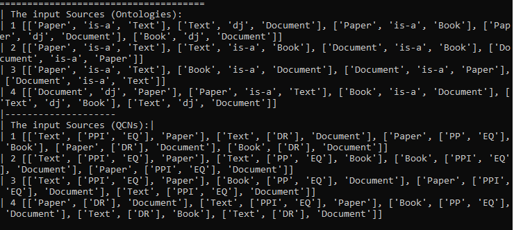
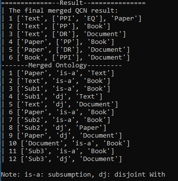

# Region-Based Merging Of Open-Domain Terminiological Knowledge
Using Qualitative Constraint Network to merge Terminiological Knowledge

Please go directly to SupplementaryMaterial.pdf to see the proofs of theorems.

How to run the Ontology Merging application:
```
python3 MergingQCN_Version2.py
```

## Source - QCNs:



## Merged Result:


